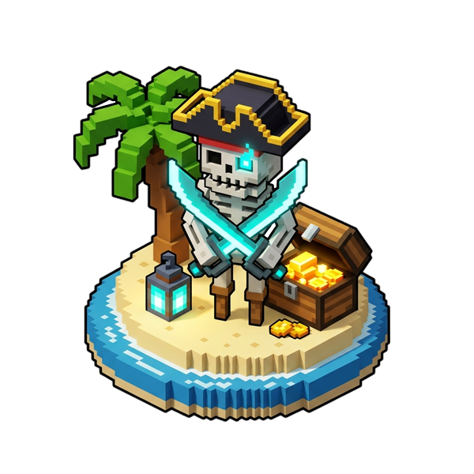

# 🏝️ Castaway: Pirate Siege

  

  <b>A Comprehensive Island Survival, Naval Warfare, Ocean Salvage & Pirate Expansion</b> 
  <i>Designed for Minecraft 26.2 (Fabric Loader)</i>

  
  
  

---

## 🏴‍☠️ About The Mod

**Castaway: Pirate Siege** reimagines solitary island gameplay into a dynamic, content-packed nautical survival experience. Stranded on an isolated tropical island amidst endless dark waters, players must master the tides to salvage drifting cargo flotsam, sift sand for ores, construct functional coastal cannons, tame loyal capuchin monkeys, trade with the elusive wandering smuggler, race beach crabs, and defend their stronghold against relentless pirate siege fleets and the legendary **Spectral Ghost Galleon**.

---

## ✨ Features Showcase

### 🎣 1. Ocean Cargo Salvage & Sifting
* **Drifting Flotsam Crates**: Ocean currents push randomized wooden cargo crates to your shores filled with food, tools, timber, and rare treasures.
* **The Flotsam Hook**: A craftable long-range grappling tool to hook and reel in floating cargo before the tide carries it away.
* **Sieve Basket**: Sift island sand and gravel to unearth vital flint, iron nuggets, clay, and precious Ocean Pearls.

---

### ⚔️ 2. Pirate Fleet Sieges & Coastal Artillery
* **Dynamic Island Raids**: Multi-wave pirate armada sieges landing on your beach in assault skiffs. Ring the **Lookout Bell** to scout incoming fleets!
* **Coastal Broadside Cannons**: Heavy defensive artillery loaded with forged iron **Cannonballs** to blast hostile ships out of the water.
* **Cutlasses & Molotovs**: Fast-sweeping pirate cutlasses and throwable incendiary molotov cocktails for crowd control.

---

### ⛵ 3. The Spectral Ghost Galleon (Full Moon Boss Event)
* **Midnight Fog Event**: Natural 40% arrival chance on full moons or midnight thunderstorms.
* **Deep Hydrodynamic Keel**: 21-block galleon featuring a 4-tier curved hull submerged 4 blocks beneath sea level, fully illuminated by 10+ soul lanterns.
* **Captain Blacktide (Boss - 125 HP)**: Board the flagship and battle the phantom captain. Dodge his **Phantom Phase Dash** and survive his **Cursed Wail** to claim the **Spectral Vault**!
* **Ghost Relics**:
  * ⚔️ **Spectral Cutlass**: Teleport dash attack dealing 8.5 soul damage.
  * 🕯️ **Cursed Ghost Lantern**: Passive underwater night vision + water breathing; active 28-block **Spectral Sonar Radar**.
* **Automatic Sunrise Dissolution**: Protected under nocturnal skies and dissolves into morning mist as soon as dawn breaks.

---

### 🦀 4. Island Ecology, Traps & Crab Racing
* **Submerged Lobster Pots**: Submerged wicker traps to harvest Lobsters, Azure/Gold/Red Crabs, and Pearl Oysters.
* **Beach Crab Racing**: Capture wild crabs, build an arena, and feed them treats to host competitive sprint races.
* **Capuchin Deckhand Monkeys**: Tame wild monkeys with cracked coconuts to sit, follow, or shoulder-mount on your voyages.
* **Island Cuisine**: Cook hearty **Spiced Crab Boils** and **Butter Lobster Tails** for powerful oceanic buffs.

---

### 🗿 5. Ancient Tiki Totems & The Wandering Smuggler
* **Carvable Tiki Totems**: Craft an ancient totem with an Ocean Pearl and carve sacred guardian blessings:
  * ☀️ **Sol (Sun Face)**: Island Strength & Mining Haste.
  * 🌊 **Moana (Ocean Face)**: Reef Conduit Power & Dolphin's Grace.
  * ⚡ **Taranis (Storm Face)**: Calls down lightning upon hostile intruders.
* **The Wandering Smuggler**: An eccentric merchant who periodically drifts ashore on a raft, trading rare pirate doubloons for exotic goods.

---

## 🔨 Crafting Recipes Reference

| Item | Recipe Ingredients | Description |
| :--- | :--- | :--- |
| **🎣 Flotsam Hook** | `2x Stick, 2x String, 1x Iron Nugget` | Grapple and reel in drifting crates |
| **🧺 Sieve Basket** | `4x Stick, 2x Oak Planks, 1x String` | Sift sand/gravel for ores & materials |
| **⚔️ Pirate Cutlass** | `2x Iron Ingot, 1x Gold Nugget, 1x Stick` | Rapid-striking pirate melee weapon |
| **💣 Coastal Cannon** | `5x Iron Ingot, 1x Dispenser, 2x Log, 1x Flint & Steel` | Heavy artillery broadside cannon |
| **⚫ Cannonball (4x)** | `4x Iron Nuggets, 1x Gunpowder` | Heavy ammunition for cannons |
| **🦞 Lobster Pot** | `4x Stick, 4x Oak Planks, 1x String` | Submerged trap for crabs and lobsters |
| **🗿 Ancient Tiki Totem**| `8x Stripped Oak Log, 1x Ocean Pearl` | Carvable island guardian totem |
| **🤿 Diving Mask** | `3x Leather, 2x Glass, 1x Copper, 2x String, 1x Iron` | Underwater clarity and clear vision |
| **🩴 Diving Fins** | `2x Leather, 2x Kelp, 1x Copper, 2x String` | Greatly boosts underwater swim speed |
| **🕯️ Cursed Ghost Lantern**| `3x Ectoplasm, 1x Soul Lantern, 1x Prismarine Shard` | Underwater sonar radar & night vision |

---

## 💻 Operator Commands

| Command | Permission | Description |
| :--- | :---: | :--- |
| `/castaway raid start` | OP | Initiates pirate siege warning phase |
| `/castaway raid assault`| OP | Skips directly to naval assault wave |
| `/castaway raid stop` | OP | Stops any active pirate raid |
| `/castaway flotsam [n]`| OP | Spawns `n` drifting cargo crates |
| `/castaway smuggler` | OP | Summons the Wandering Smuggler |
| `/castaway ghostship spawn` | OP | Spawns the Spectral Ghost Galleon |
| `/castaway ghostship despawn` | OP | Dismisses the ghost ship & restores ocean |

---

## 📄 License

This project is licensed under the [MIT License](LICENSE).
